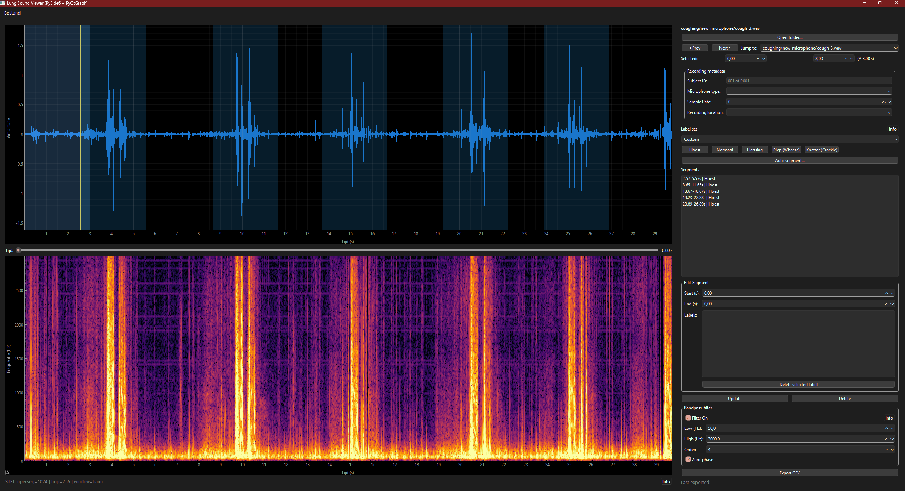

# Audio Annotation Tool

## Overview

This project is a general-purpose **Audio Annotation Tool** built with **PySide6** and **PyQtGraph**. It is designed for annotating `.wav` recordings from many domains: environmental sounds, vehicles, machines, water sounds, animals, speech, clinical audio, or any other audio dataset.

The tool is no longer specific to lung sounds or heart sounds. Labels are defined by the user in `labels_dataset.json`.



## Features

- Load `.wav` files from a selected folder, including subfolders.
- View the audio waveform and STFT spectrogram.
- Create, edit, delete, and multi-select labeled time segments.
- Select multiple segments in the segment list or directly in the waveform view.
- Apply labels to one or more selected segments.
- Remove labels from all selected segments at once.
- Use undo/redo for segment and label changes.
- Auto-segment recordings into fixed-length windows.
- Apply an optional band-pass filter for visualization and playback.
- Play full audio or individual segments.
- Store annotations per `.wav` file as JSON sidecars.
- Export all annotations to CSV.
- Store optional metadata: `environment` and `notes`.
- Empty metadata fields are not included in CSV export.

## Requirements

Recommended:

- Python 3.10 or newer

Python packages:

- PySide6
- pyqtgraph
- numpy
- pandas
- soundfile
- scipy
- sounddevice
- matplotlib

If you see errors involving type hints such as `list[str]` or `str | None`, your Python version is too old.

## Installation

### Windows PowerShell

From the project root:

```powershell
py -3.13 -m venv .venv
.\.venv\Scripts\Activate.ps1
python -m pip install --upgrade pip
pip install -r requirements.txt
```

If there is no `requirements.txt`:

```powershell
pip install PySide6 pyqtgraph numpy pandas soundfile scipy sounddevice matplotlib
```

### macOS/Linux

```bash
python3 -m venv .venv
source .venv/bin/activate
python -m pip install --upgrade pip
pip install -r requirements.txt
```

If there is no `requirements.txt`:

```bash
pip install PySide6 pyqtgraph numpy pandas soundfile scipy sounddevice matplotlib
```

## Running the application

The entrypoint is:

```text
viewer_app/app.py
```

Run the app from inside `viewer_app`:

```bash
cd viewer_app
python app.py
```

## Basic workflow

1. Start the app.
2. Choose a folder containing `.wav` files.
3. Select a time interval in the waveform.
4. Click a label button to create or update a segment.
5. Use the segment list to inspect, edit, multi-select, or delete segments.
6. Optionally fill in `environment` and/or `notes`.
7. Export all annotations to CSV.

Each `.wav` file receives a matching `.json` sidecar file next to the audio file.

## Metadata

The tool currently supports two general metadata fields:

| Field | Description |
|---|---|
| `environment` | Optional recording context, such as `indoor`, `outdoor`, `traffic`, `lab`, or `home`. |
| `notes` | Optional free-text notes about the recording. |

The last used `environment` is remembered during the session and can be reused for following files.

Empty metadata fields are omitted from CSV export. For example, if no file has `notes`, the CSV will not contain a `notes` column.

## Labels

Labels are loaded from:

```text
labels_dataset.json
```

If the file does not exist, the app creates a default one.

Example:

```json
{
  "version": 1,
  "labels": ["horn", "tap_water", "speech", "machine_noise"],
  "meta_defaults": {
    "environment": ""
  },
  "filter_defaults": {
    "lowcut": 50,
    "highcut": 3000,
    "order": 4,
    "zero_phase": true
  },
  "stft_params": {
    "nperseg": 1024,
    "hop": 256,
    "window": "hann"
  },
  "auto_segment_defaults": {
    "length_s": 3.0,
    "overlap_s": 0.0,
    "label": ""
  }
}
```

There are no built-in lung-sound or heart-sound label sets anymore. Define labels that fit your dataset.

## Keyboard shortcuts

| Shortcut | Action |
|---|---|
| Space | Play/pause audio |
| N | Next file |
| P | Previous file |
| Enter / Return | Update selected segment |
| Delete | Delete selected segment(s) |
| Ctrl + R | Reset view |
| Ctrl + Z | Undo |
| Ctrl + Y | Redo |
| Left / Right | Move selected time region |
| Shift + Left / Shift + Right | Move start of selected time region |
| Ctrl + Left / Ctrl + Right | Move end of selected time region |
| 1–9 | Toggle the first nine label buttons |

## Multi-selection

Segments can be selected in both the segment list and the waveform view.

| Action | Behavior |
|---|---|
| Click | Select one segment |
| Shift-click | Select a continuous range |
| Ctrl-click | Toggle one segment in/out of the selection |

Selected segments are shown in the waveform view with stronger fill opacity, so multi-selection is visible directly in the audio view.

## CSV export

CSV export includes one row per segment.

Base columns:

| Column | Description |
|---|---|
| `date` | Export date |
| `filename` | Relative audio filename |
| `t_start` | Segment start time in seconds |
| `t_end` | Segment end time in seconds |
| `label` | One or more labels separated by `;` |

Optional metadata columns are included only when filled:

- `environment`
- `notes`

## Project structure

```text
viewer_app/
  app.py
  src/
    app_window.py
    app_settings.py
    data_models.py
    dialogs.py
    widgets.py

    audio_processing.py
    audio_playback.py
    file_paths.py
    label_colors.py

    controllers/
      ui_builder.py
      shortcuts.py
      audio_view.py
      file_io.py
      segments.py
      metadata.py
      labels.py
```

### Main modules

| File | Purpose |
|---|---|
| `app.py` | Application entrypoint |
| `app_window.py` | Main `App` class and shared application state |
| `app_settings.py` | Constants, preferences, metadata fields, and labels path |
| `data_models.py` | `Segment` and `FileState` dataclasses |
| `dialogs.py` | Folder selection and auto-segmentation dialogs |
| `widgets.py` | Custom UI widgets |
| `audio_processing.py` | Band-pass filtering and STFT computation |
| `audio_playback.py` | Audio playback through `sounddevice` |
| `file_paths.py` | Path helpers and time snapping |
| `label_colors.py` | Stable label-to-color mapping |

### Controllers

| Controller | Purpose |
|---|---|
| `ui_builder.py` | Builds the Qt UI and connects signals |
| `shortcuts.py` | Registers keyboard shortcuts |
| `audio_view.py` | Waveform, spectrogram, playback, filter, and selection region |
| `file_io.py` | Folder loading, WAV reading, JSON sidecars, navigation, and CSV export |
| `segments.py` | Segment list, selection, editing, labels, undo/redo, and auto-segmentation |
| `metadata.py` | Environment/notes handling and recent environments |
| `labels.py` | Loading labels from `labels_dataset.json` |

## Data files

### JSON sidecars

Each `.wav` file gets a `.json` file with the same base name:

```text
recording_001.wav
recording_001.json
```

The sidecar stores the file state, metadata, segments, and labels per segment.

### `labels_dataset.json`

This file defines labels and optional default settings. It is created automatically when missing.

## License

Free to use and modify for research, education, and general audio annotation workflows.