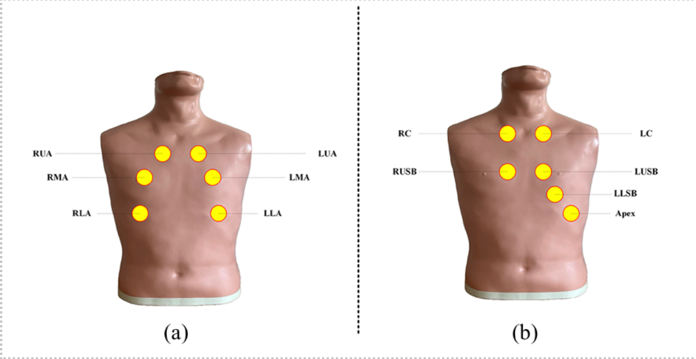

# General recording locations for heart and lung sounds

When recording heart and lung sounds, it’s essential to use consistent anatomical reference points. The tables below summarize the most common recording sites used in research and clinical practice.
Illustrations are adapted from:

- **Heart Sounds**: [IEEE-studie, 2024](https://ieeexplore.ieee.org/document/10981596)
- **Lung Sounds**: [PubMed-studie, 2019](https://pubmed.ncbi.nlm.nih.gov/30708353/)

### Heart Sounds

| Location    | Description                                           | Commonly heard sounds                           |
| ----------- | ----------------------------------------------------- | ----------------------------------------------- |
| **Apex**    | 5th intercostal space, slightly below the left nipple | Prominent S1 (“lub”) and S2 (“dub”) heart tones |
| **RUSB**    | 2nd intercostal space, right of the sternum           | **Aortic valve** sounds                         |
| **LUSB**    | 2nd intercostal space, left of the sternum            | **Pulmonary valve** sounds                      |
| **LLSB**    | 4th–5th intercostal space, left of the sternum        | **Tricuspid valve** sounds                      |
| **RC / LC** | Right and left clavicular borders                     | May reveal additional tones or murmurs          |

### Lung Sounds

| Location        | Guideline              | Note                                                |
| --------------- | ---------------------- | --------------------------------------------------- |
| **Trachea (T)** | Above the sternum      | Distinct air flow during inspiration and expiration |
| **RUA / LUA**   | Upper chest (ribs 2–4) | Upper lung fields                                   |
| **RMA / LMA**   | Mid chest (ribs 4–6)   | Mid lung fields                                     |
| **RLA / LLA**   | Lower chest (ribs 6–8) | Lower lung fields                                   |

Standardizing these locations ensures reproducible and comparable recordings between your own studies and the public studies mentioned above, and aligns with the labeling scheme used in the Lungsound Annotation Tool.